# Morphological Image Reconstruction

Holds code for a project made when taking the coarse "Image Preprocessing" in FMI.

## Quick Start

```bash
python3 -m venv venv
./venv/bin/activate
pip install -r requirements.txt
# you can now run the notebook :)
```

## Description and formulation of the problem

The morphological transformations discussed in class involved combinations of one input image with specific structuring elements. The approach taken with morphological reconstruction is to consider **two input images**. A morphological transformation is applied to the first image and it is then forced to remain either above or below the second image. The morphological transformations are restricted to elementary erosions and dilations and the choice of specific structuring elements is therefore **eluded**. In practice, geodesic transformations are iterated until stability making the choice of a size unnecessary. It is actually the combination of appropriate pairs of input images which produces new morphological primitives. These primitives are at the basis of formal definitions of many important image structures for both binary and grey scale images.

In this project we are going to use morphological reconstruction to **show two applications of it on binary images**:

1. Remove user-specified objects from an image via morphological reconstruction.
2. Remove objects connected to the border of an image via morphological reconstruction.

## Analysis of algorithms and methods

In the binary case, reconstruction simply extracts the connected components of a binary image I (the mask) which are "marked" by a (binary) image J contained in I. This transformation can be extended to the grayscale case, where it turns out to be extremely useful for several image analysis tasks such as geodesic interpolation.

The mentioned morphological transformations are often referred to as **geodesic**. A **geodesic dilation** involves two images: a **marker** image and a **mask** image. By definition, both images must have the same definition domain and the mask image must be greater than or equal to the marker image. The marker image is first dilated by the elementary isotropic structuring element (i.e. a square filled with ones). The resulting dilated image is then forced to remain below to the mask image. **The mask image acts therefore as a limit** to the propagation of the dilation of the marker image. Let *f* denote the marker image and *g* the mask image (*Df = Dg* and *f <= g*). The geodesic dilation of size *1* of the marker image *f* with respect to the mask image *g* is defined as the point-wise minimum between the mask image and the elementary dilation of the marker image:

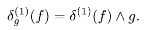

Geodesic dilation on a binary image is shown below:

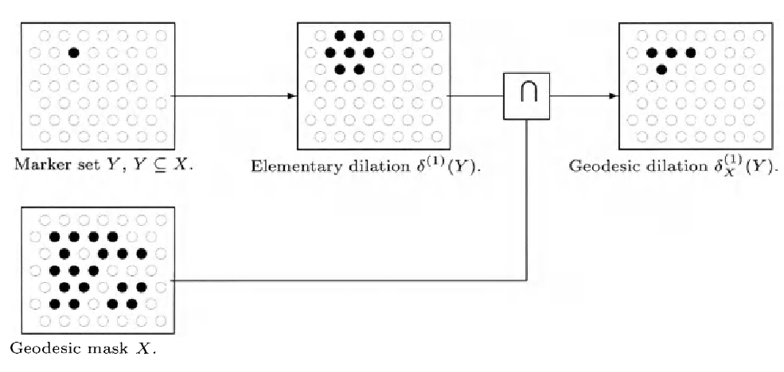

The **geodesic erosion** is the dual transformation of the geodesic dilation with respect to set complementation. The marker image is first eroded and second the point-wise maximum with the mask image is calculated. An example of geodesic erosion is provided below:

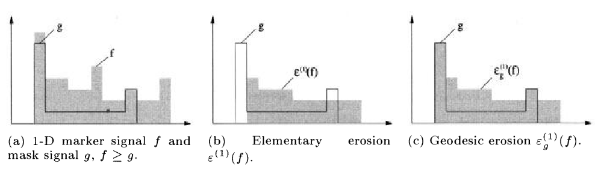

The mask image acts as a limit to the shrinking of the marker image. Given the duality between geodesic erosions and dilations, geodesic erosions are increasing and anti-extensive. Owing to the point-wise maximum operator, the geodesic erosion of an image remains greater or equal to its mask image. The geodesic erosion of size *n* of a marker image *f* with respect to a mask image *g* is obtained by performing *n* successive geodesic erosions of *f* with respect to *g*:

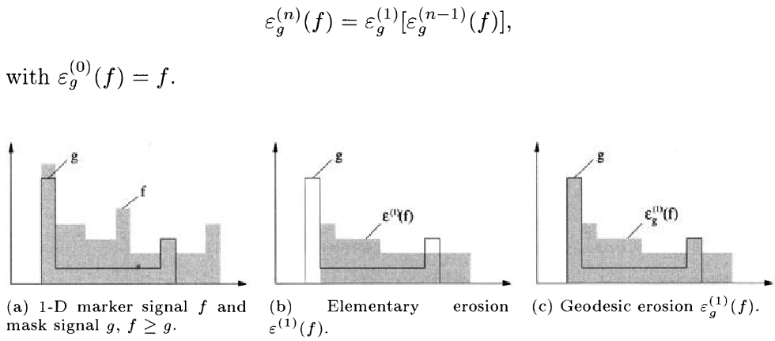

There exists an alternative definition of the geodesic erosion for binary images. It is also dual to the geodesic dilation but with respect to another set complementation where the whole space is restricted to the geodesic mask *X*. Hence, the complement of a subset *Y* of *X* is *X \ Y* rather than *Y<sup>c</sup>* and we obtain the following definition:

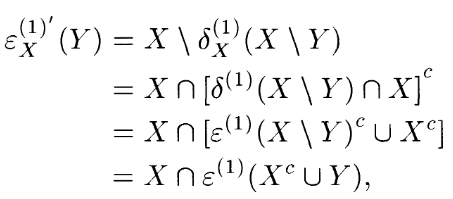

The alternative definition of the geodesic erosion is illustrated below on a two-dimensional image. The pixels *p* of the marker set *Y* removed by the geodesic erosion are those having a neighbor belonging to the geodesic mask *X* but not to the marker set:

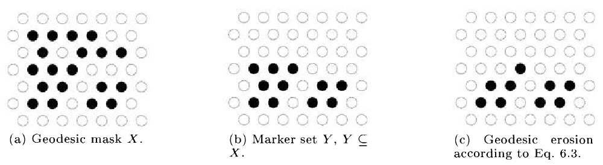

Geodesic transformations of bounded images always converge after a finite number of iterations (i.e. until the propagation or shrinking of the marker image is totally impeded by the mask image). **Morphological reconstruction** of a mask image from a marker image is based on this principle.

**Reconstruction by dilation**. The *reconstruction by dilation* of a mask image *g* from a marker image *f* (*Df = Dg* and *f <= g*) is defined as the geodesic dilation of *f* with respect to *g* iterated until stability:

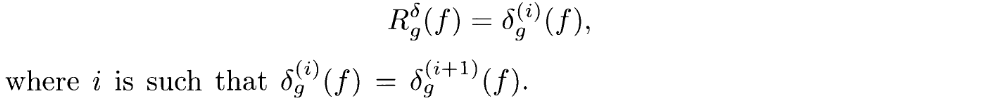

The reconstruction by dilation of a 1D signal is illustrated below. Stability is reached after the fifth geodesic dilation:

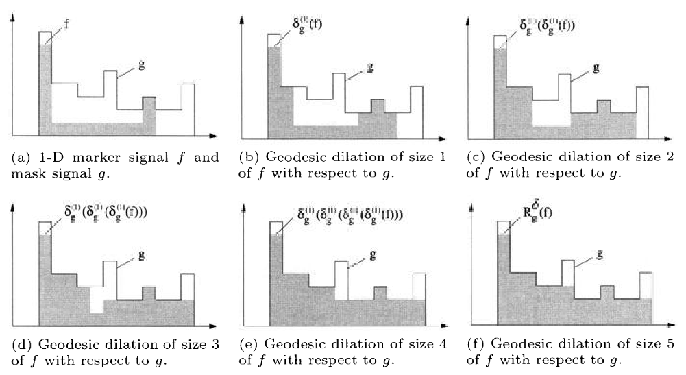

**Reconstruction by erosion**. The *reconstruction by erosion* of a mask image *g* from a marker image *f* (*Df = Dg* and *f >= g*) is defined as the geodesic erosion of *f* with respect to *g* iterated until stability:

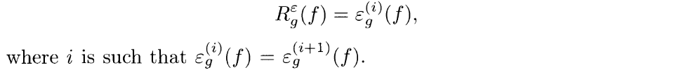

**Implementation**. The raw algorithm for implementing a morphological reconstruction by dilation of a mask image *g* from a marker image *f* consists in iterating sequences of elementary dilations and point-wise image transformations. This algorithm is best suited for parallel processors. On sequential computers, a better approach is to perform the point-wise minimum while computing the dilation. In this latter case, a succession of forward and backward image sequential scans are necessary.

## Description of the chosen algorithms and methods for solving the problem

Because the project does not aim to show efficiency, we'll stick to a sequential implementation.

In our approach we'll create the mask ourselves, but in the general case there are some good practices. A suitable marker image can be determined using:

- knowledge about the expected result;
- known facts about the image or the physics of the object it represents;
- some transformations of the mask image itself;
- other image data if available (i.e., multispectral and multitemporal images);
- interaction with the user (i.e., markers are manually defined).

One or usually a combination of these approaches is considered. The third one is the most utilized in practice but it is also the most critical because it requires the selection of an adequate transformation or even a sequence of transformations. For the reconstruction by erosion and dilation, the marker image has to be greater (resp. less) than the mask image. It can then be generated using extensive (resp. anti-extensive) transformations.

**The first application** we'll show illustrates how reconstruction by dilation can reconstruct of all objects of an image *X* marked by an image *Y*. The idea is that due to the sequence of geodesic dilations, the propagation of the seeds is restricted to the particles they belong to. An example is shown below:

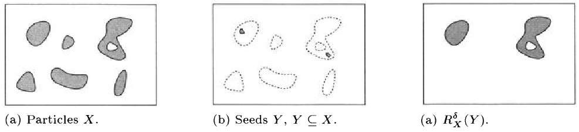

This can be done by manually creating the mask with the seeds and then passing that mask iterating with that mask until the objects get "filled".

**The second application** is going to be removing particles connected to the image border. In many applications it is necessary to remove all particles connected to the image border. Indeed, they may introduce some bias when performing statistics on particle measurements. Particles connected to the image border are extracted using the **input image as mask image** and the **intersection between the input image and its border as marker image**. The marker image contains therefore **seeds** for each particle connected to the image border and the reconstruction outputs the image of all these particles. Note that large blobs have a higher probability to intersect the image border than small blobs. Statistical methods must be considered for compensating this bias.

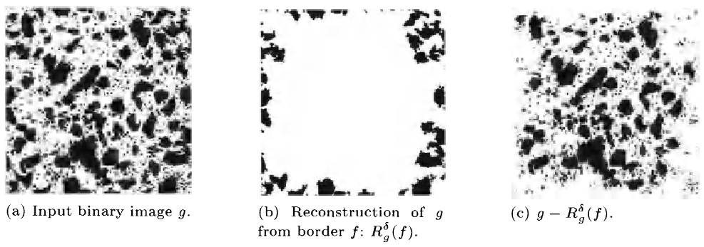

## Plan of attack

- [X] Read and add review of *Understanding Morphological Image Processing and Its Operations*.
- [X] Read and add review of *Intro to Morphological Reconstruction*.
- [X] Read and add review of *Morphological Reconstruction*.
- [X] Read and add review of *Efficient Morphological Reconstruction: A Downhill Filter*.
- [X] Read and add review of *Morphological Grayscale Reconstruction in Image Analysis: Applications and Efficient Algorithms*.
- [X] Read and add review of *How To Make Geodesic Dilation And Erosion In Morphology*.
- [X] Write preliminary theory for morphological reconstruction in the binary case - leaving only the objects that are marked.
- [X] Explore the API of scikit-image. Will use it to check whether my implementations match those in scikit-image.
- [X] Get the datasets mnist (digits), fashion_mnist (clothes), and emnist (characters).
- [X] Elementary dilation for grayscale images. Validate with scikit-image on the random images from the datasets.
- [X] Elementary erosion for grayscale images. Validate with scikit-image on the random images from the datasets.
- [X] Geodesic dilation for grayscale images. Validate with scikit-image on the random images from the datasets.
- [X] Geodesic erosion for grayscale images. Validate with scikit-image on the random images from the datasets.
- [X] Morphological reconstruction using dilation. Validate with scikit-image on the random images from the datasets.
- [X] Read and add review of chapter 6 from the book *Morphological Image Analysis, Principles and Applications*.
- [X] Add application 1.
- [X] Add application 2.
- [X] Theory iteration 2.

## Resources

### APIs

- [scikit-image](https://scikit-image.org/docs/stable/api/skimage.morphology.html)

### Books

- [Morphological Image Analysis, Principles and Applications](https://link.springer.com/book/10.1007/978-3-662-05088-0)

### Articles

- [Understanding Morphological Image Processing and Its Operations](https://towardsdatascience.com/understanding-morphological-image-processing-and-its-operations-7bcf1ed11756)
- [Intro to Morphological Reconstruction](https://www.mathworks.com/help/images/understanding-morphological-reconstruction.html)
- [Morphological Reconstruction](https://www.ni.com/docs/en-US/bundle/ni-vision-concepts-help/page/morphological_reconstruction.html)
- [How To Make Geodesic Dilation And Erosion In Morphology](https://epochabuse.com/geodesic-dilation-and-erosion/)

### Papers

- [Morphological Grayscale Reconstruction in Image Analysis: Applications and Efficient Algorithms](https://people.cmm.minesparis.psl.eu/users/marcoteg/cv/publi_pdf/MM_refs/Vincent/93ieeeip_recons.pdf)
- [Efficient Morphological Reconstruction: A Downhill Filter](https://doras.dcu.ie/18762/1/whelan_2004_104.pdf)

### YouTube

- <https://www.youtube.com/watch?v=WQK_oOWW5Zo>
- <https://www.youtube.com/watch?v=MFDAq09s1e4>
- <https://www.youtube.com/watch?v=Y0yZ-BkxEDs>
- <https://www.youtube.com/watch?v=R9FRXbuqxao>
- <https://www.youtube.com/watch?v=_P_EkWkSz_o&list=PLFXza2AmUJa-0tG-V0woFEb5eRe1-JDvC>
- <https://www.youtube.com/watch?v=mbMM2CMI5nk>
- <https://www.youtube.com/watch?v=MZntbMD6PnE>
- <https://www.youtube.com/watch?v=IcBzsP-fvPo>
